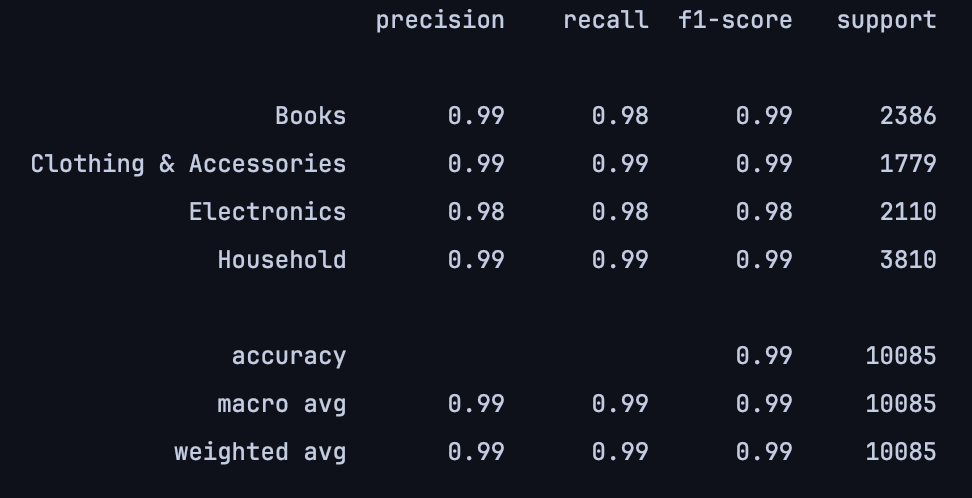
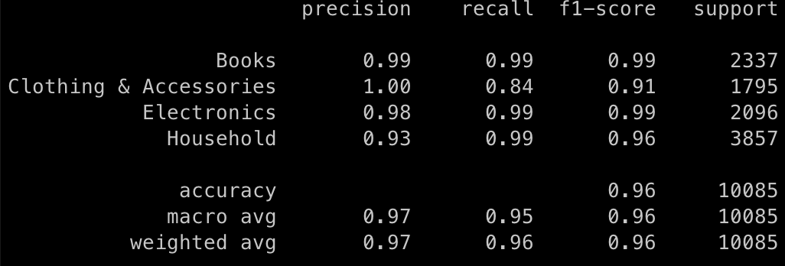

# flan-t5 Fine-tuning for Text Classification

This GitHub project is aimed at fine-tuning the flan t5 model for a text classification task using an E-commerce
text dataset for 4 categories - "Electronics", "Household", "Books" and "Clothing & Accessories".


## Evaluation Statistics
### AutoModelForSequenceClassification
Text Classification model can be found on [HuggingFace](https://huggingface.co/VanekPetr/flan-t5-small-ecommerce-text-classification). The model is trained on the dataset and evaluated on the test set. The evaluation metrics are as follows:
<p>
  </a>
</p>

The main **advantage** of this model is that together with prediction it outputs the confidence score for each class. This can be used to filter out the predictions with low confidence.

### AutoModelForSeq2Seq
Text2Text Generation model can be found on [HuggingFace](https://huggingface.co/VanekPetr/flan-t5-base-ecommerce-text-classification). The model is trained on the dataset and evaluated on the test set. The evaluation metrics are as follows:
<p>
  </a>
</p>

## Dataset

The dataset is a classification-based E-commerce text dataset, which almost covers 80% of any E-commerce website. The dataset consists of product and description data for 4 categories. The dataset can be found [here](https://doi.org/10.5281/zenodo.3355823).

## Project Features

The project employs the tokenizer of flan-t5 by Hugging Face, which helps in splitting the input text into a format that is understandable by the model.

An evaluation function has been implemented for post-processing the labels and predictions, which will also handle sequence length adjustments.

The project uses `Seq2SeqTrainer` and `SequenceClassification` for training the model. It also includes a helper function to preprocess the dataset.

## Usage

To leverage the project you need to run the `flan-t5-finetuning.py` script which will trigger the training of the model.

The 'train' function fine-tunes the flan-t5 model, trains it with the dataset, outputs the metrics, creates a model card and pushes the model to Hugging Face model hub.

The preprocess function tokenizes the inputs, and also handles tokenization of the target labels. The compute_metrics function evaluates the model performance based on the F1 metric.

## Getting Started

STEP 1: create and activate python virtual environment
``` bash
python -m venv venv
source venv/bin/activate
```

STEP 2: install requirements with [poetry](https://python-poetry.org/docs/#installing-with-the-official-installer)
``` bash
poetry install -vv
```

## Versioning

We use [SemVer](http://semver.org/) for versioning. For the versions available, see the [tags on this repository](https://github.com/VanekPetr/flan-t5-text-classifier/tags).

## License

This repository is licensed under [MIT](LICENSE) (c) 2023 GitHub, Inc.
